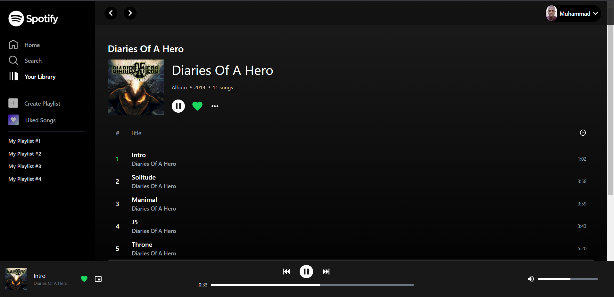
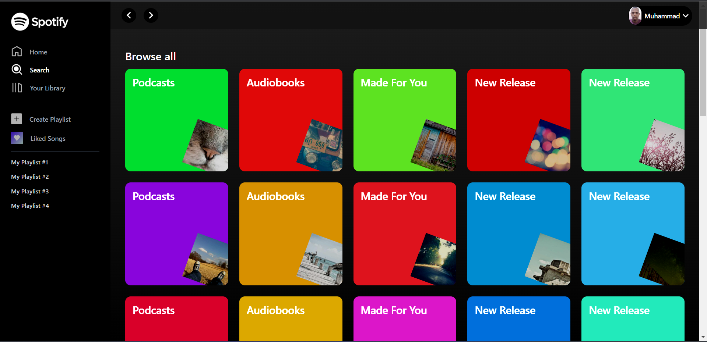
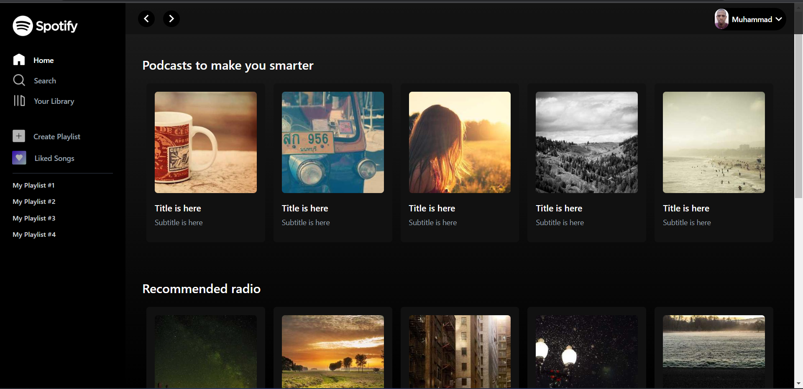

# Vue 3 Spotify Clone Dummy App

### Table of Contents

- Tech Stack
- Screenshots
- Installation
- License

### Tech Stack

- Frontend: Vue 3 Composition API
- Styling: TailwindCSS

### Screenshots of the dummy project

### Installation

- Clone the repository: https://github.com/programwithmuhd/spotify-clone.git
- Install dependencies: npm install

### License
This project is licensed under the MIT License
